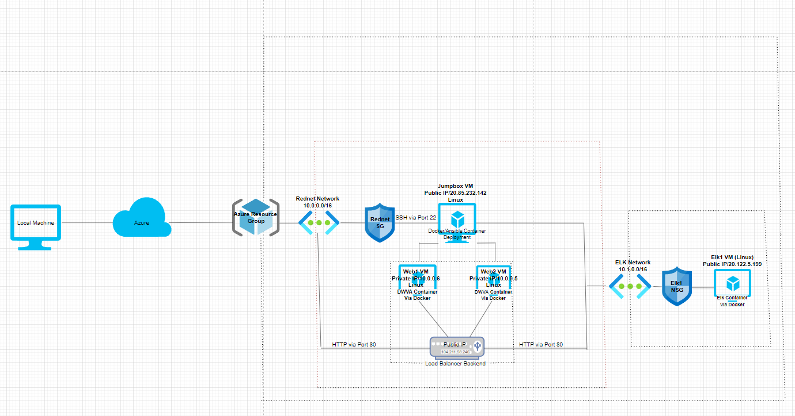
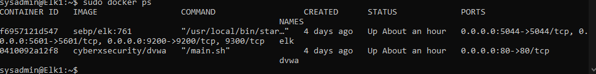

## Automated ELK Stack Deployment

The files in this repository were used to configure the network depicted below.

These files have been tested and used to generate a live ELK deployment on Azure. They can be used to either recreate the entire deployment pictured above. Alternatively, select portions of the Ansible file may be used to install only certain pieces of it, such as Filebeat.

Ansible/Elk.yml

This document contains the following details:
- Description of the Topologu
- Access Policies
- ELK Configuration
  - Beats in Use
  - Machines Being Monitored
- How to Use the Ansible Build

### Description of the Topology

The main purpose of this network is to expose a load-balanced and monitored instance of DVWA, the D*mn Vulnerable Web Application.

Load balancing ensures that the application will be highly accessible, in addition to restricting certain traffic to the network.
Load balancers make sure incoming connections aren't strained and can prevent certain unwanted incoming network traffic. The advantage
to keeping a jumpbox is that the internal webservers can only be managed by the jumpbox itself - via ssh within its own private network.

Integrating an ELK server allows users to easily monitor the vulnerable VMs for changes to the logs and system traffic.
Filebeat monitors the log files or certain file locations that you specified, collects all log events, and fowards them
to either Elasticsearch or Logstash for Indexing.
Metricbeat takes metrics and statistics. Metricbeat also helps you monitor servers by collecting these metrics from the system
and services running on said server.

| Name     | Function | IP Address | Operating System |
|----------|----------|------------|------------------|
| Jump Box | Gateway  | 10.0.0.7   | Linux            |
| Web-1    | Webserver| 10.0.0.6   | Linux            |
| Web-2    | Webserver| 10.0.0.5   | Linux            |
| Elk1     | Monitor  | 10.1.0.4   | Linux            |

### Access Policies

The machines on the internal network are not exposed to the public Internet. 

Only the Jumpbox machine can accept connections from the Internet. Access to this machine is only allowed from the following IP addresses:
72.220.206.241 (Home Network IP)

Machines within the network can only be accessed by the Jump Box.
The machines within the network including the Elkbox can only be accessed from the following ip:
72.220.206.241

A summary of the access policies in place can be found in the table below.

| Name     | Publicly Accessible | Allowed IP Addresses |
|----------|---------------------|----------------------|
| Jump Box | Yes                 | 72.220.206.241       |
|    Web1  | No                  | 10.0.0.7             |
|    Web2  | No                  | 10.0.0.7             |
|    Elk1  | No                  | 10.0.0.7             |
### Elk Configuration

Ansible was used to automate configuration of the ELK machine. No configuration was performed manually, which is advantageous because...
Every VM can recieve the same configurations at the same time, and be deployed from one VM without having to access multiple at once.
This allows you to swiftly deploy programs across many vms at once without much or any manual invervention.

The playbook implements the following tasks:
- Configure Webservers
- Download Filebeat/Metricbeat
- Install Filebeat/Metricbeat
- Copy/drop in filebeat.yml and metricbeat.yml file from main machine
- Enable and configure Filebeat/Metricbeat system
- Setup Filebeat/Metricbeat
- Start Filebeat/Metricbeat
The following screenshot displays the result of running `docker ps` after successfully configuring the ELK instance.

### Target Machines & Beats
This ELK server is configured to monitor the following machines:
10.0.0.6 (Web-1)
10.0.0.5 (Web-2)

We have installed the following Beats on these machines:
Metricbeat
Filebeat

These Beats allow us to collect the following information from each machine:
Filebeat is monitoring log events and changes on each Webserver, While Metricbeat is gathering metrics and statistics from the services running
on each webserver and outputting them. A use example would be 'process.name' which shows us the name of the process accessed, along with
a timestamp.

### Using the Playbook
In order to use the playbook, you will need to have an Ansible control node already configured. Assuming you have such a control node provisioned: 

SSH into the control node and follow the steps below:
- Copy the Playbook files ending in .yml to your ansible directory.
- Update the ansible host file to include the ip of your web servers and ELK server.
- Run the playbook, and navigate to YourIpHere:5601/app/kibana# to check that the installation worked as expected.

### Information
The playbooks are Filebeat-playbook.yml and Metric-playbook.yml and need to be copied into your ansible directory.
To make ansible run on the configured machine, you need to update the ansible hosts file to include your servers IP. 
Add an [Elk] line to specify that this is an ELK machine.
YourIpHere:5601/app/kibana# to make sure the ELK server is up and running.

